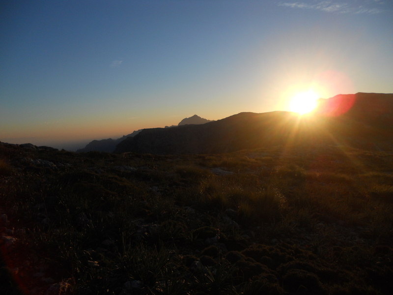
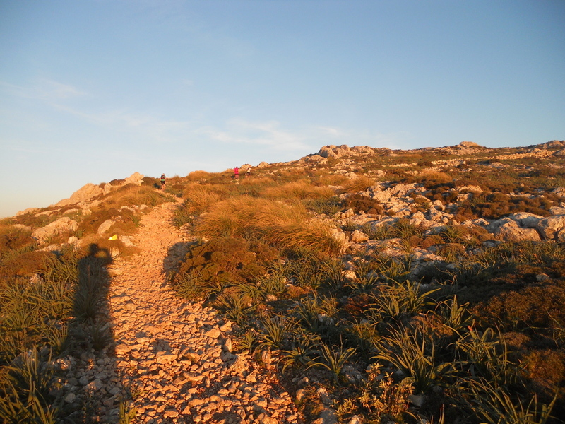
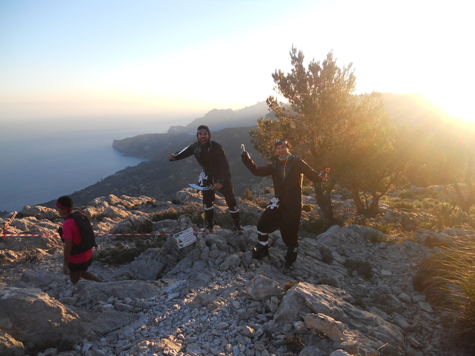
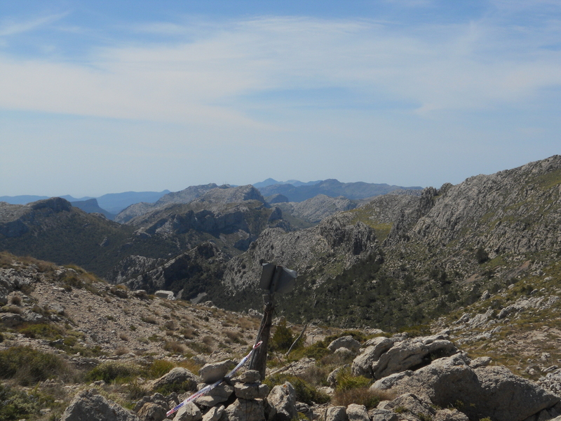
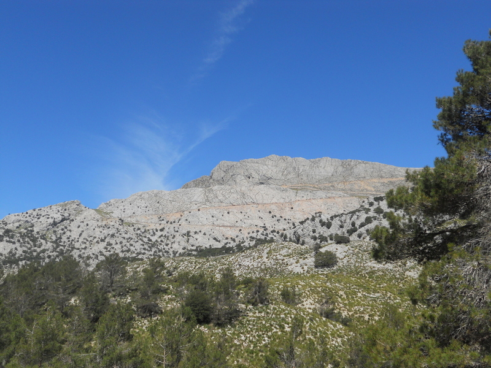

19 mai 2014, _Pollença_, petit village dans le nord-est de Majorque, une fin d’après-midi... 
> L’important c’est de participer!

me sort une dame debout devant la porte de sa maison, quand je lui ai dit que je ne pouvais plus courir. Perso, cette phrase, “L’important c’est de participer“, je l’ai toujours trouvé débile. Beaucoup diront c’est vrai, l’important c’est de gagner, pas de participer, mais là encore, pas d’accord. De nos jours quand on voit comment on “gagne”, ça fait presque pitié. Donc en trail, une phrase qui a pas mal de sens serai:
> l’important c’est de terminer (dans un état qui ne soit pas lamentable).

Tout avait commencé quelques heures auparavant à _Andratx_, un autre petit village de Majorque, cette fois-ci au nord-ouest. Et oui, facile à deviner, le plan était de relier les 2 villages. En théorie, faisable n’importe quel jour de l’année. En pratique seulement possible un jour l’année, lorsque les propriétaires des terrains traversés par le GR-221 sont d’accord de laisser passer les gens, autrement dit, le jour de la course. Voilà pourquoi je m’étais inscris. À Gran Canaria par exemple, il n’est pas très difficile de traverser l’île simplement en suivant les chemins, car il n’y a pas des propriétés privées partout.



__Résumé de la course:__ les 70 premiers km, super, le reste, ça a chié! Pour les détails, ce ne sera pas pour le blog, mais plutôt autour d’un verre ou bien pendant un entraînement avec les potes! Je préfère un format “bons moments” et “bad trips”.

## Bon moments

- le départ d’_Andratx_, bonne ambiance avec les 400-500 autres traileurs, un peu de musique, mais en comparaison avec d’autres épreuves de trail, c’était plutôt ambiance soirée de village, pas trop de bruit pour ne pas réveiller les voisins. Et de l’aphalte. Beaucoup.
- Après quelques km, dans une montée, ça commence à bouchonner à cause d’un passage délicat, où il fallait un peu escalader. J’attends mon tour et passe, puis une fois monté, demande au suivant s’il veut un coup de main pour monter. Visiblement content (voire surpris), il accepte et je lui tends le bras pour l’aider à grimper. Surprise: ça a dû être l’exception, je n’ai vu personne d’autre donner un coup de main à son poursuivant… C’est ça l’esprit T.r... ta-gueule!
- la partie nuit, ce dont je redoutais le plus, et au final qui s’est avéré super sympa: bonne température, terrain agréable, presque pleine lune, les cris d’animaux… toute une ambiance mystérieuse lors des passages dans les villages (déserts) pour les ravitaillements. Juste quelques coureurs qui faisaient des bruits bizarres, entre raclements de gorge et sons non-identifiables, où alors avec leur musique à fond, quand on leur dit “attention” quand il y a un trou ou un obstacle, ils font “heeeeeein, quoi???”. Prochaine fois on ne dira rien.
- le levé de soleil sur le _Camí de s’Arxiduc_. Même si la nuit s’est bien déroulée, ça a fait du bien de voir enfin le soleil, surtout de là-haut. Bon ok, on n’est pas censé prendre des photos, c’est un sport sérieux. 

|  |   	|
|	---|---	|

- les bénévoles et les supporters: pas vraiment la grande foule sur les chemins (interdiction de comparer avec d’autres courses), mais quand même bien rigolé par moment. Par exemple ici, ces gars qui contrôlaient nos “chips”, déguisés en pirates (même si je n’ai pas compris à quoi ça rimait). Quand ils ont vu que je sortais l’appareil photo, ils ont prix la pose et commencer à crier “wahhhhhhhhh“.
|  |
|:--:|
| _Le début de la descente vers Deià._|

- Le passage au _Coll des Prat_ (1205 m), point le plus élevé de la course, après une montée assez hard et monotone, avec des pierres bien blanches qui réfléchissaient la lumière dans la tronche. Une vue spectaculaire d’une grande partie de l’île. Sans doute le point que je choisirai pour prendre des photos de coureurs lors d’une prochaine édition!
|  |
|:--:|
| _Vue la sur Tramuntana depuis Le Coll des Prat._|

## Bad trips

Évidemment si tout passait comme une lettre à la poste, ça n’aurait pas de mérite. Dans mon cas, il faut toujours qu’il y ait un grain de sable dans l’engrenage (voire plusieurs).

- Les ravitaillements: gros efforts point de vue alimentation, aussi bien hors course que durant le trail, alors tout devait bien se passer. Sauf quand j’ai l’impression que le gars au ravito a bien rempli mon sac, mais qu’en fait il y a moins d’un litre (pour 18 km, donc pas trop grave, juste la gorge sèche). Ou mieux, lorsqu’à un autre ravito, le gars (un autre) remplit la proche d’eau, mais en versant la moitié de la flotte dans le sac, d’où GSM momentanément détruit (donc disqualification si on me chope!!), et coupe-vent trempé. Merci copain.
  
- La montée du _Barranc de Biniaraix_: une superbe montée en zig-zag sur un chemin pavé, le long d’un torrent, splendide. J’avais préparé cette montée plusieurs fois, toujours en courant, mais là, impossible, je commençais à en avoir plein le c**. Et donc avancer si lentement là où j’avais l’habitude d’aller vite, c’est un peu démoralisant.

- La descente vers _Lluc_: une descente bien bien pourrie et technique, sur un chemin pavé, puis dans des pierres de merde. J’avais aussi bien préparé cette descente, et ça avait été super bien, mais là, impossible, je me chopais des pierres dans les chevilles tous les 5 mètres, chaque fois que j’essayais de me relancer. En un mot, cette descente elle m’a tué les 2 pieds.  Et tapé un sale coup dans le moral. Arrivé au ravitaillement de _Llucs_, dernier avant l’arrivée, je crois que j’aurais dû abandonner, et aller dire bonjour au docteur pour avoir un ptite dose d’anti-douleur (remarque: à tous les arrêts ça puait le réflex spray à 100 m à la ronde, je crois que certains traileurs l’utilisent comme déodorant), puis merda, il reste 17 bornes, je vais me les faire, que ce soit en courant, en marchant ou en rampant. Et sans l’aide du docteur.
  
- Les 2 derniers km: la fin a été comme je l’imaginais: pourrie. Ma vitesse diminuait à chaque km, et même sans GPS, fallait pas avoir étudié Ingénieur Civil Physicien (titre non-homologué en Espagne, soit-dit en passant) pour savoir que je devais être en-dessous des 3 km/h. Honteux! Chaque pas me donnait soit envie de pleurer, soit envie de gerber. Les gars m’encourageaient un peu, “ànim, falta poc!“, mais ça ne changeait rien: il fallait terminer ce qui était commencé. Pas pour être sur la photo finale, ni pour le veste de finisher (une sorte de polaire de la marque _The North Face_ que je n’oserai jamais porter). Juste parce qu’avec mon GSM noyé, j’aurais eu du mal à retrouver ma copine que m’attendait.

Au bout de ces 2 derniers km, me voici enfin dans le village de _Pollença_. Du monde il y en a, certes, mais moins d’ambiance que lors du premier ravitaillement à 6h du mat’ de la Transvulcania (bon ok, à Mallorca ils s’en foutent un peu plus de ce sport, chacun ses gouts). Donc cette dame me sort: “l’important c’est de participer“. Oui madame, j’ai participé à cette course, je l’ai terminée comme il se devait, sans l’aide du médecin, sans aide “extérieure” comme ceux qui se font ravitaillé par leurs potes entre les étapes, et sans gerber sur la ligne d’arrivée, et quand même en courant sur la fin, juste pour le fun. En terminant, je me suis dit que j’avais payé le prix fort, au propre (140€) comme au figuré (pieds explosés). Mais ça en valait la peine.

|  |
|:--:|
| _Ravitaillement près du Lac de Cúber._|

## Les conclusions?

1. __Entraînements:__ not bad, mais peut et doit mieux faire. Super sensations sur 70 km, aussi bien en montée qu’en descente, puis après, relâchement. Au final, sans doute possible de faire 2 heures de moins sur le parcours en gérant mieux la distance et l’effort. Positif aussi, les seules douleurs sont celles aux pieds, les cuisses et mollets s’en sortent indemnes.
2. __Alimentation:__ beaucoup de changements qui portent leurs fruits. A continuer.
3. __Matériel:__ complètement pris (volontairement) à la légère: produits de base de la boutique que tout le monde connaît et que je ne nommerai pas, sauf pour les chaussures, des SpeedCross, qui à mon avis ne convenait pas du tout au type de terrain (du très dur sur quasi tout le trajet). Pas de trucs de compression, pas de chaussettes pour les bras, pas de pansements sur les mollets... A prendre plus au sérieux.
4. __Mental:__ en général quand je commence la course, je sais que je vais la terminer (sauf si c’est le jogging de Verviers), donc pas trop de problème. Il y a eu des sales bad trips sur la course, et pas vraiment d’opportunités d’échanger quelques mots avec d’autres coureurs pour penser à autre chose (et pas de lecteur MP3 pour écouter _Bon Jovi_, _Calvin Harris_, ou les _To Be Three_), mais ces sales moments ils ont une durée de vie très limitée, raison pour laquelle il vaut mieux ne pas leur prêter attention
5. __La suite?__ Content d’avoir terminé, dans un temps pas trop mauvais, mais je ne me sens pas passionné par ce sport comme certains de mes amis, qui j’espère se reconnaitront. J’ai vu les photos des gars qui passait la ligne d’arrivée comme si c’était un truc énorme… peut-être ça l’était, mais perso j’arrive pas à me dire qu’on a fait autre chose que d’avoir été d’un village à un autre à pied, en passant par quelques cols de la Tramuntana.
