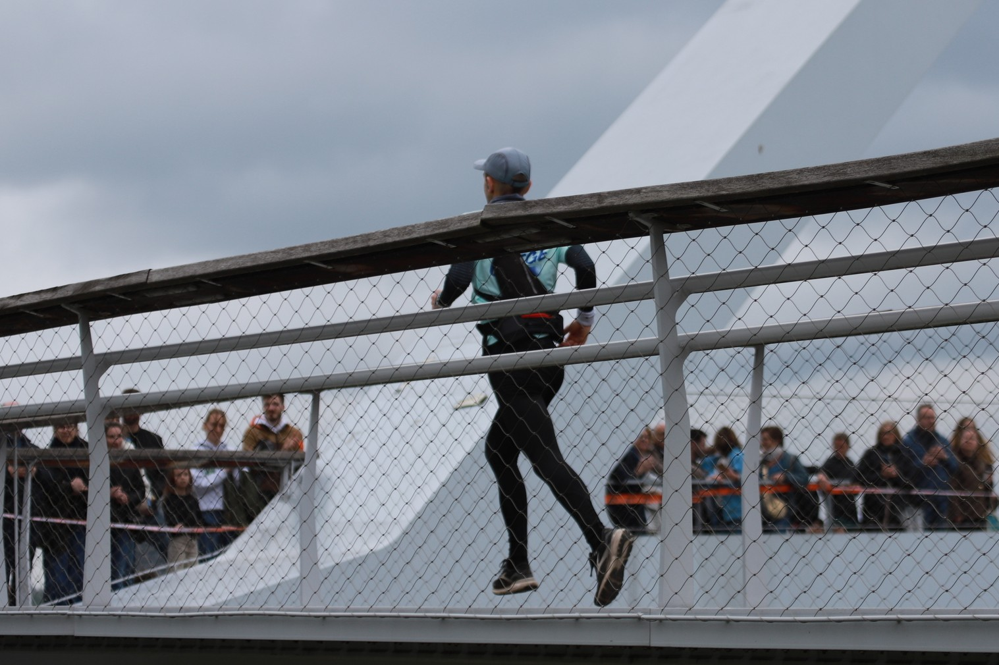

---------------

Plusieurs coureurs (et coaches) ont pris le départ d'une des courses proposées ce dimanche. Marc avait choisi le Trail de 42 km, qui reliait Comblain-la-Tour à Liège. Il termine premier de sa catégorie `M65`. John termine le trail de 21 km, en 2° position dans la catégorie `M45` tandis que Mars termine 9° dans la catégorie `SEH`. Romain, Sinclair, Nicolas (coach 2023-2024) et Joël bouclent le classique 15 km dans de très bons temps 👏👏 



| Coureur | &nbsp; Temps   | &nbsp; Course        | 
| -----   | :-------: | :-----------:   |
| Marc    | 4:38:20	| &nbsp;&nbsp;&nbsp;	Trail 42 km | 
| John	  | 1:52:40	| &nbsp;&nbsp;&nbsp;  Trail 21 km |
| Mars    | 1:49:06 | &nbsp;&nbsp;&nbsp;  Trail 21 km |
| Joël    | 1:11:57	| 15K       |
| Romain  | 1:03:41	| 15K 	    |
| Nicolas |	1:08:02	| 15K       |
| Sinclair| 1:02:53	| 15K       |

