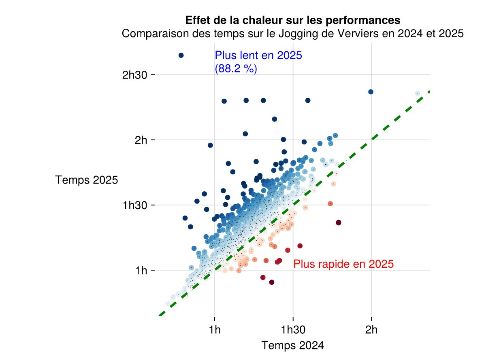

---------------

42° édition du (Grand) Jogging de Verviers, Marc, Romain et Charles étaient sur la ligne de départ sous une chaleur accablante, plus de 35°C! 
Romain termine quelques minutes au-dessus de l'heure de course et se classe 8° dans la catégorie Vétérans 2, tandis que Marc se classe 6° dans les Vétérans 3.

| Coureur | &nbsp; Temps   | 
| -----   | :-------: | 
| Marc    | 1:08:48 | 
| Romain  | 1:02:57 | 
| Charles | 0:59:01 | 
|         |         |



La chaleur aura eu un certain impact, avec un grand nombre de coureurs clairement plus lents que lors de l'édition précédente.

##  Photos


