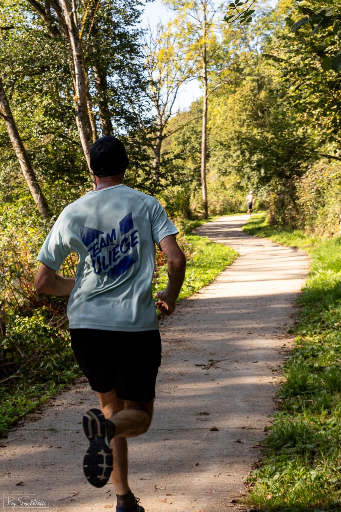

Joël et John ont participé à la 2° édition du Semi-Marathon de l'Ourthe qui a eu lieu le 8 octobre.

Les deux coureurs ont battu leur record sur cette distance (en plus d'autres records sur des distances intermédiaires): John termine en 1:32:45 (42° et 9° en V1) et Joël en 1:35:25 (55° et 12° en V1). 

##  Le parcours



##  Photos

