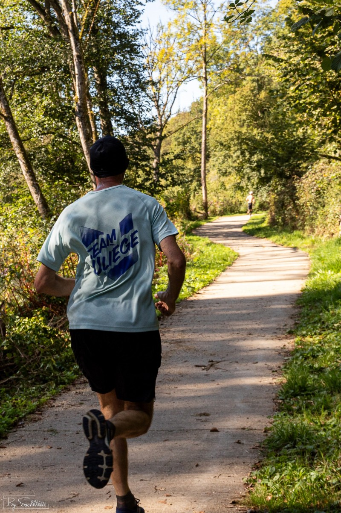

---------------

Joël et John ont participé à la 2° édition du Semi-Marathon de l'Ourthe qui a eu lieu le 8 octobre.

Les deux coureurs ont battu leur record sur cette distance (en plus d'autres records sur des distances intermédiaires): John termine en 1:32:45 (42° et 9° en `V1`) et Joël en 1:35:25 (55° et 12° en `V1`).

Deux excellents performances sur un parcours qui n'est pas spécialement rapide.

##  Le parcours

Le tracé prend son départ à Esneux et passant par Poulseur, Chanxhe, Rivage, Comblain, pour terminer à Hamoir. 



##  Photos

