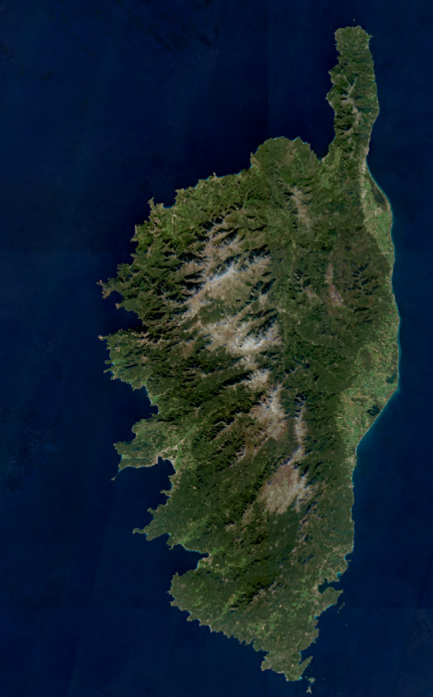

#### Est-ce que tu peux te présenter (en moins de temps qu'il ne te faut pour courir un 400 m)?

John, 47 ans, marié à Emily et père de trois enfants. Je suis Professeur de physique à l'ULiège, passionné par l'enseignement et la recherche en physique théorique.        
J'habite à Esneux, en pleine nature, où j'aime aller me promener et courir, surtout le dimanche avec mon chien Yoko. J'aime aussi la bonne bouffe et les bières belges.

#### Un surnom?

_Johnny_ quand j'étais plus jeune ;)

#### 📆 Depuis quand cours-tu?

Depuis mes 36 printemps.

#### Comment tu as atterris dans la course à pied?

Grâce à un collègue de département qui se préparait pour un marathon.

#### 😵‍💫 Une contre-performance ou un plan foireux que tu évites de raconter ? (Joker est une réponse acceptée)

Ma participation au cross de Seraing, que j'ai couru presque entièrement en état de suffocation et d’asphyxie.

#### 🏅 Une course ou une sortie dont tu es particulièrement fier?

Le [15 km de Liège](https://www.zatopekmagazine.com/les-15km-de-liege-metropole/) 2016, bouclé en 1 heure et 26 secondes.



#### 🏝️ Le plus bel endroit où tu as couru?

En Corse 🇫🇷

#### 🗺️ Ta plus longue distance en course ou pour le fun?

À peine 25 km (trail des 15 km de Liège en 2018)... Par contre, j’ai fait plus jeune la [Kennedymars Sittard](https://www.kennedymars.org/), une marche de 80 km en moins de 12h.

#### 🏃‍♂️🏃‍♀️ Un coureur ou une coureuse que tu as comme modèle?

Je n'ai pas de modèle car je cours avant tout pour mon bien-être et le plaisir, mais j'aime suivre les performances de grands coureurs comme Kilian Jornet et Kenenisa Bekele.

#### 🏁 Une course que tu rêverais de faire (si tu avais le temps et les moyens illimités)?

[Sierre-Zinal](https://www.sierre-zinal.com/) 🇨🇭

#### Question extra (des autres coureurs)

> Marc: Qu’est-ce qui te motive à pratiquer la course à pied ?

Les bouffées d'endorphine et rester en forme.
