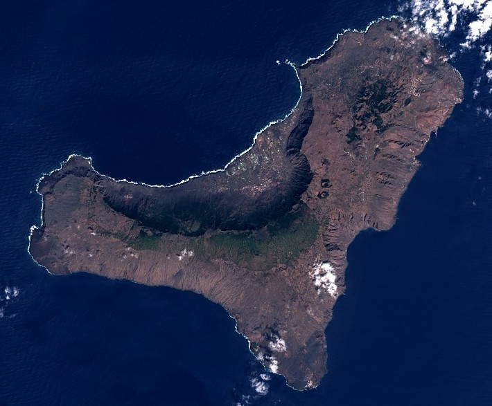

#### Est-ce que tu peux te présenter (en moins de temps qu'il ne te faut pour courir un 400 m)?

Philippe Cerfontaine; j'aime le sport d'endurance (triathlon), la programmation et les animaux 😉

#### Un surnom?

_Châssis_        
`NDLR:` n'hésitez pas à demander des explications complémentaires à Philippe concernant ce surnom.

#### 📆 Depuis quand cours-tu?

+/- régulièrement depuis que j'ai 15 ans.

#### Comment tu as atterris dans la course à pied?

Par un ami dont le père était coureur de marathons.

#### 😵‍💫 Une contre-performance ou un plan foireux que tu évites de raconter ? (Joker est une réponse acceptée)

Fracture de fatigue en tentant de faire les [15km de Liège](https://www.zatopekmagazine.com/les-15km-de-liege-metropole/) en moins d'une heure.

#### 🏅 Une course ou une sortie dont tu es particulièrement fier?

Le tour du barrage d'Eupen en moins d'une heure.



#### 🏝️ Le plus bel endroit où tu as couru?

[El Hierro](https://elhierro.travel/fr) 🇮🇨      
`NDLR:` la plus petite des Îles Canaries.

#### 🗺️ Ta plus longue distance en course ou pour le fun?

Marathon.

#### 🏃‍♂️🏃‍♀️ Un coureur ou une coureuse que tu as comme modèle?

[Marc Binard](../marc/) 😄

#### 🏁 Une course que tu rêverais de faire (si tu avais le temps et les moyens illimités)?

La [Transvulcania](https://transvulcania.com) 🇮🇨

#### ❓❓ Une question que tu aurais voulu qu'on te pose, ou qu'on pose aux suivants?

?